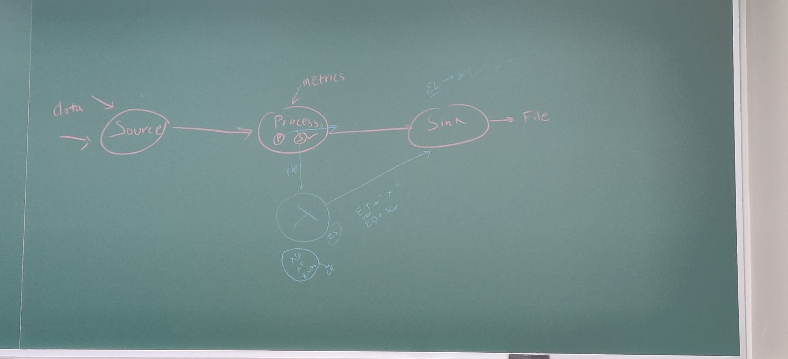

Date - 3 February 2023
Agenda - discuss implementation and difference between process function and flatMap
Duration - 11:30 AM to 12:30 PM
Paticipants - All group members

------------------------------------------------------------------------------------------
|     src       |   ------->  |      processFunction       | ------->  |      sink      |
------------------------------------------------------------------------------------------

- Use a fire and forget model
- Find how to have a random source generator
- Professor had said that a process function is better since future implementations can be done directly in process function as opposed to flatmap operator
- The tokenized output has to be written out to file
- The file is required to assess accuracy of result
- Accuracy of result will give metric of efficiency of proposed solution
- We require metrics before process function in nexmark pipeline to determine whether the stream data will be sent to lambda or whether it will be sent to process function 
- We will try to implement the model as illustrated in the above image