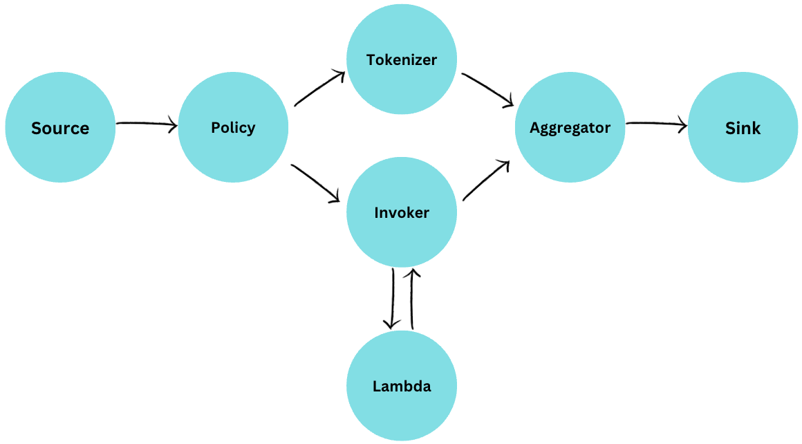
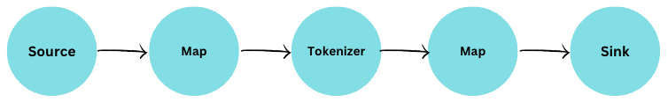
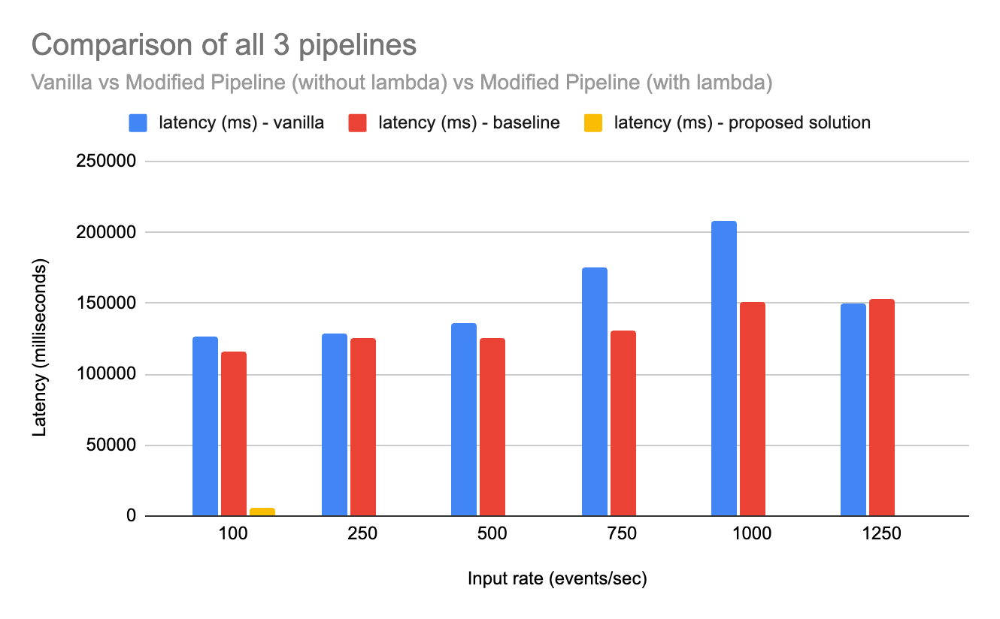
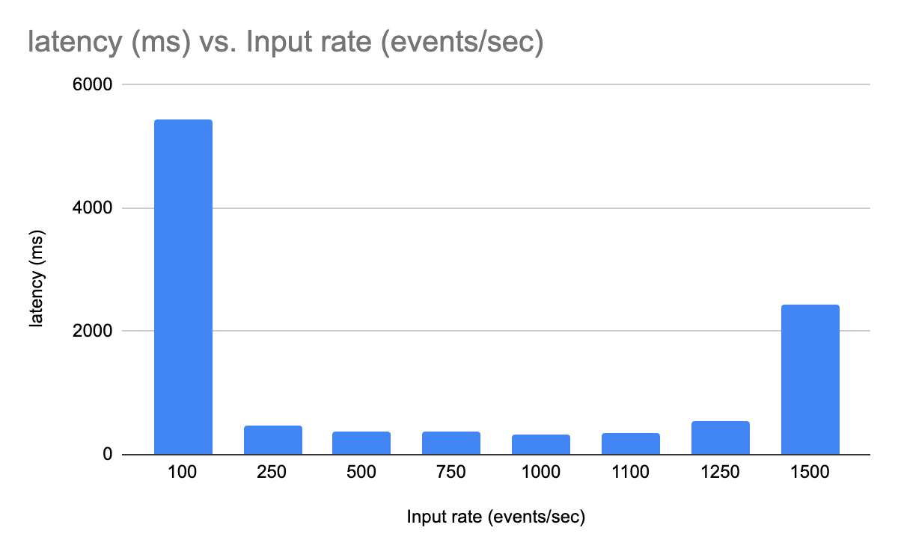
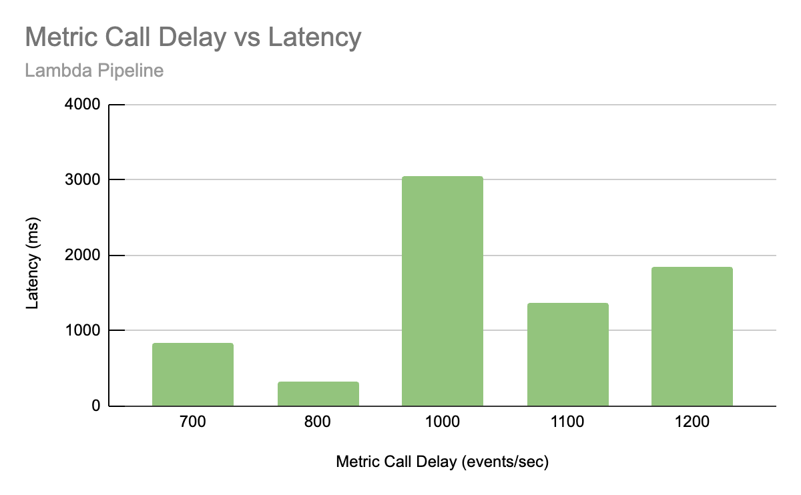
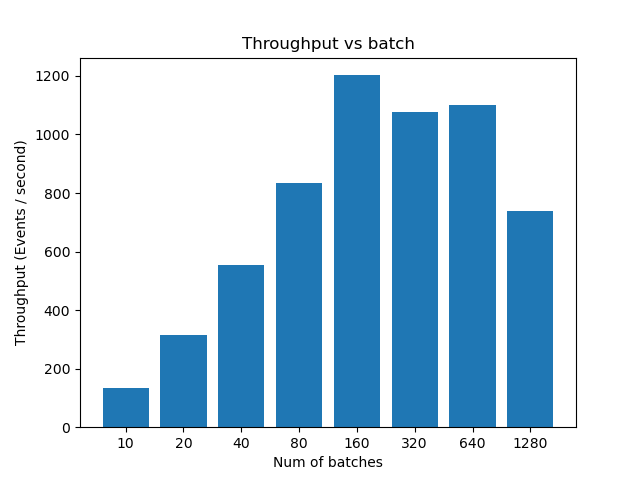
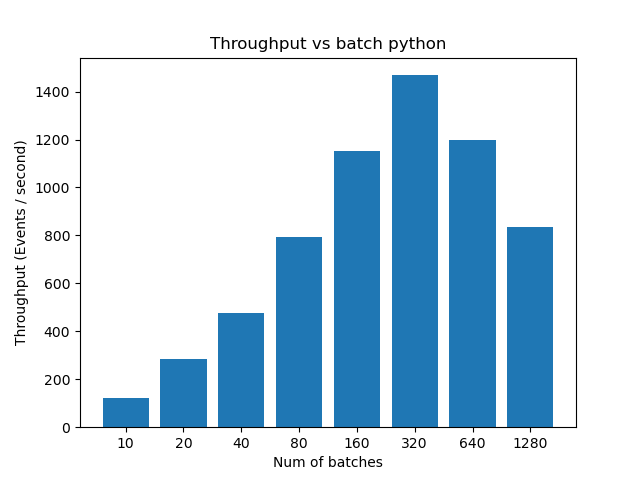

<h2 style="text-align: center;"> Addressing transient workload spikes with Cloud bursting in Apache Flink</h2>

**Problem statement:** 
  - **Problem**:  This project aims to address is to provide a solution for handling sudden spikes in workload in Apache Flink applications. This is an important problem because Apache Flink is a distributed stream processing framework that is designed to handle large amounts of data in real time. However, when the input rate exceeds the processing capacity, the system can become overwhelmed, leading to increased latency, decreased performance, and even failures.
  - **Technique**:  The cloud bursting technique is an alternative to back-pressure, which is a mechanism that slows down the input rate when the system is overwhelmed. Instead, cloud bursting allows the excess workload to be offloaded to a cloud provider, such as AWS, where it can be processed in parallel. This can help to ensure that the system continues to operate at a high level of performance, even when there is a sudden spike in workload. 

**Source**:

Nexmark is a benchmark suite for queries over continuous data streams. This project is inspired by the [NEXMark research paper](https://web.archive.org/web/20100620010601/http://datalab.cs.pdx.edu/niagaraST/NEXMark/) and [Apache Beam Nexmark](https://beam.apache.org/documentation/sdks/java/testing/nexmark/).

These are multiple queries over a three entities model representing on online auction system:

Person represents a person submitting an item for auction and/or making a bid on an auction.
Auction represents an item under auction.
Bid represents a bid for an item under auction.

**Basic Architecture**:

**Run instructions**:

- Environment -
    - Java 8 
    - Flink version - 1.16.0
    - IntelliJ

- Using Intellij - 
    1. Build your Maven project using the command `mvn clean package`, which will generate a JAR file for the Flink pipeline, or create a Maven run configuration in `Intellij` to run the command `clean package`
    2. Install all dependencies using Maven.
    3. Create another application run configuration with `main` class as `operator.FlinkPipeline`. Select the `Add dependencies with 'provided' scope to classpath` option. Set the working directory as `team-6/Code/deliverable-2`.  
    4. Build the project using the application run configuration to generate the jar files in the `target` folder.

- Using Command Line (MacOS) - 
    1. Install Maven `brew install maven`
    2. Create ~/.mavenrc file and add line `export JAVA_HOME=<path>`. You can get the path using ` /usr/libexec/java\_home`. We have built the project with `java8` as the version, so that's the version we can assure you.
    3. Go to `Code/deliverable-2` directory and run `mvn clean package`
    4. This should create the `flink-java-project-0.1.jar` file under the `target` folder.

- To run on Flink web UI -
    1. Start the Flink cluster ( ./start-cluster.sh )
    2. Go to http://localhost:8081 in your browser
    3. Upload the jar file to the Flink web UI under the `submit a job` tab

**Source Configurations**:

To change configurations at the source, navigate to the file `NexmarkConfiguration.java` under `team-6/Code/deliverable-2`.

For instance, for changing the `input rate` change the configuration variable `firstEventRate` and `nextEventRate` and change the value of variable `ratePeriodSec` for changing the duration of the spike.

**Lambda Deployments**:

Although the lambda functions are already deployed with an exposed API gateway, the following are the steps to deploy the lambda functions in your account.

- **Setup IAM**:
    1. Go to AWS account > IAM
    2. Click on `Add user` and add a new user with `Programmatic Access`
    3. Add permissions for `AWSLambdaFullAccess`
    4. Save the `Access ID` and `Secret Access Key` for the new user.

- **Python**: 
    1. Run `npm i -g serverless` in terminal.
    2. Navigate to `team-6/Code/PythonCloudBurstOperator/cloud-burst-operator-python`
    3. Run `serverless config credentials --provider aws --key <access-id> --secret <secret-access-key>`
    4. Run `serverless deploy`

- **Java**: 
    1. Install `AWS SDK` tools for Java Intellij.
    2. Ensure `Docker` is installed and is properly running.
    2. Navigate to `team-6/Code/CloudBurstOperator`
    3. Right-click on the project root in Intellij and click on `Serverless Application sync` option.

**Experimental Setup**:
- **Pipelines**:

    Apart from the Figure 1 solution pipeline, for comparison, we also ran our experiments on 2 baseline pipelines.
    - **Baseline 1**
    
     - **Baseline 2**
    

- **Measurements**:
    - **Parallelism**:
        1. The input rate is set to 500 events/sec and 100000 events are generated from the source.
        2. The job parallelism is set to 1,2,4,8 and the completion is measured.
        3. Configuration values kept constant:
            - Input Rate = 1000 events/s 
            - Duration of Experiment = 5mins 
            - Metric Call Latency = 800 ms 
            - Max Records Sent = 100000 

    - **Backpressure duration**: 
        1. The duration of 5 mins.
        2. Input rates - 100, 250, 500, 750, 1000events/sec.
        3. Configuration values kept constant:
            - Duration of Experiment = 5mins 
            - Parallelism = 1 
            - Max Records Sent = unlimited,  
            - Batch size change-every 8 secs 
            - Metric Call Latency = 1000 ms

    - **Metric calculation interval**: 
        1. The input rate is set to 500 events/sec and 100000 events are generated from the source.
        2. Metric calculation delay values tested - 700ms, 800ms, 1000ms, 1100ms, 120ms.
        3. The completion time and the accumulated backpressure is tested
        4. We found **800ms** to be the best with our experiments.
        5. Configuration values kept constant:
            - Input Rate = 1000 events/s  
            - Duration of Experiment = 5mins 
            - Parallelism = 1 
            - Max Records Sent = unlimited
            - Batch size change-every 8 secs

    - **Lambda**: 
        1. The pipeline is run from the source to the invoker operator, removing all the other operators.
        2. Batch size:
            - Java: 1-10; step size=1 
            - Python: 1-10; step size=1 and 20-100; step size=10
        3. 5 experiments are run on each batch size
        4. Latency is measured for each batch
    and throughput is measured for all the data.

    - **Latency**:
        1. Add the current timestamp when the event enters the pipeline. Before writing to sink - subtract the current timestamp with a timestamp in the event to get the latency for that record.
        2. Performed on all 3 pipelines - vanilla, modified pipeline (without lambda), proposed solution
        3. Input rates - 100, 250,500,750,1000,1250,1500 - tested for 5 minutes
        4. 3 experiments are run on each input rate.
        5. For the proposed solution, configuration values:
            - MEASURE_INTERVAL_MS = 800ms
            - INPUT_THRESHOLD = 500
            - BUSY_TIME_THRESHOLD = 0.06

**Experiments Result Plots**:
<table>
   <tr>
        <td> </td>
        <td> Latency plot for all 3 pipelines [1]</td>
   </tr> 
   <tr>
        <td></td>
        <td> Latency plot scaled just for the proposed solution [1]</td>
   </tr>
   <tr>
        <td></td>
        <td> Plot to measure backpressure accumulation on various input rates for all 3 pipelines. The proposed solution self-rectifies backpressure encountered in the subsequent interval cycles [2]</td>
  </tr>
  <tr>
        <td></td>
        <td> Plot to measure metric delay interval vs the latency for the proposed solution [2]</td>
  </tr>
  <tr>
        <td></td>
        <td> Plot to measure pipeline parallelism vs the time to pipeline completion for the proposed solution [2]</td>
  </tr>
  <tr>
        <td></td>
        <td> Plot to measure the time taken by the AWS Lambda function written in Java to process events of different batch sizes as a box plot [3]</td>
  </tr>
  <tr>
        <td></td>
        <td> Plot to measure the average time taken by the AWS Lambda function written in Java to process events of different batch sizes as a box plot [3]</td>
  </tr>
  <tr>
        <td></td>
        <td> Plot to measure the time taken by the AWS Lambda function written in Python to process events of different batch sizes as a box plot [4]</td>
  </tr>
  <tr>
        <td></td>
        <td> Plot to measure the average time taken by the AWS Lambda function written in Python to process events of different batch sizes as a box plot [4]</td>
  </tr>
  <tr>
        <td></td>
        <td> Plot to measure the average throughput of the AWS Lambda function written in Java to process events of different batch sizes as a box plot [3]</td>
  </tr>
  <tr>
        <td></td>
        <td> Plot to measure the average throughput of the AWS Lambda function written in Python to process events of different batch sizes as a box plot [4]</td>
  </tr>
</table>

- [1] Refer to `experiments/latency` for sample data collection files. For complete data collected during latency experiments, go [here](https://drive.google.com/drive/folders/1r1DIEufWfF7mCvdcldEuDxCuXZn6JSNQ?usp=share_link)
- [2] Refer to `experiments/metricdelay-backpressure-parallelism` for sample data collection files.
- [3] Refer to `experiments/invoker/java` for sample data collection files.
- [4] Refer to `experiments/invoker/python` for sample data collection files.
- Refer to `assets/` for image files of all the plots for a closer view.

**Future work**:
- Handling stateful operations/operators.
- Security in AWS Lambda
- Fault tolerance - Currently project relies on Flink and AWS out-of-the-box fault tolerance, but the plan is to incorporate systems like Kafka in the pipeline to ensure no packets are lost between Flink and AWS Lambda.

